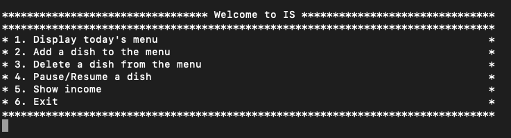

# Restaurant information system
This is the program which simulates a primitive restaurant IS where clients can make their orders
interacting with a gadget connected to the IS. The program can work in two basic modes, admin and visitor mode.
Working in the admin mode user can edit the menu, temporary remove and retrieve some dishes and display 
the income of the restaurant. A user working in the visitor mode can register a new profile and log in, 
make an order, confirm it and "pay" for it. Also, visitor can display any previous order 
that they have ever had ordered at the restaurant.

# Installation
1. Download MySQL
2. Log in as a root user
3. Type the following command: CREATE DATABASE rest_IS;
4. Open smartsys.c file and change the value of password variable to the password you use to log in MySQL (line 13)
5. Exit MySQL and execute make file
6. Type the following command: .\smartsys install to create all needed tables in your database
7. Now you can use the program!

# Documentation
All documentation and diagrams for the project you can find in the folder "docs". There is Entity Relationship diagram, 
use case diagram and documentation generated with Doxygen.

# Author
Sokolovskii Vladislav

A student of Brno University of Technology (1st year)

This is my first project that I've implemented entirely by myself.

# Tech Stack
1. C language
2. SQL 
3. UML 2.0
4. Doxygen
